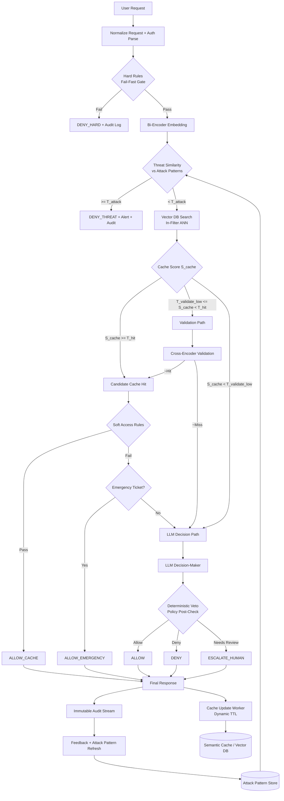
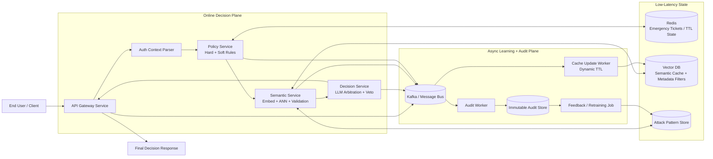

# LLM Access Control Data Flow (Adaptive + Production-Ready)

## 1) Scope
This design governs authorization decisions for natural-language requests using:
- Deterministic policy checks (hard rules).
- Semantic cache retrieval with strict metadata isolation.
- LLM-backed final arbitration for uncertain or novel requests.
- Continuous feedback loops for security and performance improvement.

Primary goals:
- `Fail closed` on uncertainty or control-plane failure.
- Keep P95 latency low with a cache-first strategy.
- Maintain explainability and auditable decisions.

## 2) System Inputs
| Input | Description | Example | Format |
|---|---|---|---|
| Access Request | Natural-language access intent from user/client | "I am the on-call nurse; I need patient X record." | Text |
| Context | Runtime metadata used for policy and risk checks | `{"time":"03:00","location":"ER","role":"nurse","history":"5 prior approvals"}` | JSON / structured |
| Access Rules | Deterministic policy constraints for allow/deny | `grant if role in approved_roles and time in emergency_window` | Policy-as-code (XACML/Rego/Cedar) |
| Feedback | Post-decision outcomes used for retraining and tuning | `{"decision":"deny","reason":"role mismatch","time":"03:05"}` | CSV / JSON events |

## 3) System Outputs
| Output | Description | Example | Format |
|---|---|---|---|
| Decision | Final access response returned to client | `{"access":"granted","confidence":0.92,"reason":"emergency context validated"}` | JSON |
| Cache Update | Cache write payload for future semantic matches | embedding + normalized intent + decision + policy version + TTL | Vector DB record |
| Alert | Security notification for anomalies/high-risk patterns | `Anomaly detected: similarity to privilege escalation pattern (0.87)` | Notification / webhook |
| Audit Event | Immutable evidence for compliance and replay | decision source, scores, policy version, latency | Event stream / object store |

## 4) Canonical Request Contract
Every request is normalized before processing.

```json
{
  "request_id": "uuid",
  "timestamp_utc": "ISO-8601",
  "user": {
    "user_id": "string",
    "role": "string",
    "department": "string",
    "region": "string",
    "clearance_level": "int"
  },
  "context": {
    "ip_address": "string",
    "device_id": "string",
    "session_id": "string",
    "mfa_state": "passed|failed|unknown",
    "incident_state": "normal|elevated|critical"
  },
  "resource": {
    "resource_type": "document|table|api|tool",
    "resource_id": "string",
    "sensitivity": "public|internal|restricted|confidential"
  },
  "query": {
    "prompt": "string",
    "purpose": "string"
  }
}
```

## 5) End-to-End Flow
### Phase A: Ingestion and Hard Deny Gate
1. Parse identity, network, and resource metadata.
2. Evaluate deterministic hard rules:
- Blocked users, blocked IP/CIDR, banned role-resource pairs.
- Mandatory controls not satisfied (MFA missing, expired session).
3. If any hard rule fails, return `DENY_HARD` immediately and log.

Output: `allow_to_semantic_pipeline = true|false`.

### Phase B: Embedding and Threat Similarity
1. Generate query embedding using a fast bi-encoder.
2. Compare against a vector collection of known malicious/abusive patterns.
3. If `threat_similarity >= T_attack`, return `DENY_THREAT` and trigger alert.

Default: `T_attack = 0.85` in balanced mode.

Output: `safe_for_cache_lookup = true|false`.

### Phase C: Semantic Cache Retrieval with In-Filter ANN
1. Search vector DB with metadata filters applied inside ANN query:
- `role`, `department`, `region`, `clearance_level`, `resource_type`.
- `not_expired` and optional policy version compatibility.
2. Compute best-match score `S_cache`.
3. Route by score:
- `S_cache >= T_hit` -> direct cache-hit path to soft access rules (skip cross-encoder).
- `T_validate_low <= S_cache < T_hit` -> validation path.
- `S_cache < T_validate_low` -> LLM decision path.

Default thresholds in balanced mode:
- `T_hit = 0.90`
- `T_validate_low = 0.70`

### Phase D: Validation and Soft Access
For uncertain matches only (`T_validate_low <= S_cache < T_hit`):
1. Cross-encoder validates query against retrieved cached intent/answer/policy tuple.
2. If validated (`~hit`), route to the same soft access rule path used by direct cache hits.
3. Soft access checks include transient constraints:
- Active incident posture.
- Temporary policy exceptions.
- Rate anomaly on user/session.

Emergency branch:
- If soft checks fail but a valid emergency ticket exists, allow cached response with `ALLOW_EMERGENCY`.
- Otherwise escalate to LLM decision path.

### Phase E: LLM Decision-Maker (Veto Logic)
1. Compose policy-aware prompt with structured facts only.
2. LLM proposes `allow|deny|escalate` plus reason.
3. Deterministic post-check vetoes any LLM output violating hard policy.
4. Return final decision:
- `ALLOW`
- `DENY`
- `ESCALATE_HUMAN`

### Phase F: Post-Decision Updates
1. Write decision and explanation to immutable audit stream.
2. If eligible, update semantic cache with:
- Embedding, normalized intent, decision artifact, policy version.
3. Apply dynamic TTL (see below).
4. Feed suspicious/incorrect outcomes into blacklist retraining pipeline.

## 6) Adaptive Operating Modes
Thresholds and strictness adjust automatically by risk posture.

| Mode | Trigger | T_attack | T_hit | T_validate_low | Behavior |
|---|---|---:|---:|---:|---|
| Performance | Stable traffic, low incident | 0.88 | 0.88 | 0.68 | More cache reuse, lower cost |
| Balanced | Default | 0.85 | 0.90 | 0.70 | Normal production posture |
| Conservative | Incident/elevated risk | 0.80 | 0.93 | 0.75 | More validation + more LLM arbitration |

Mode selection signals:
- Incident severity.
- Drift in false-allow metric.
- Cache contamination alerts.

## 7) Dynamic TTL Policy
Cache freshness is determined by:
- Role volatility.
- Resource sensitivity.
- Decision confidence.
- Policy change frequency.

Reference formula:

`TTL = base_ttl(role, sensitivity) * confidence_factor * policy_stability_factor`

Guardrails:
- Minimum TTL: 5 minutes.
- Maximum TTL: 24 hours for non-sensitive data, 2 hours for confidential data.
- Immediate invalidation when policy version changes.

## 8) Reliability and Failure Behavior
- Vector DB unavailable -> bypass cache, go to LLM path with stricter soft checks.
- LLM unavailable -> fail closed for restricted/confidential; optional human escalation for internal/public.
- Redis ticket store unavailable -> disable emergency bypass.
- Audit stream unavailable -> continue response path but enqueue local durable retry buffer.

## 9) SLO Targets
- Authorization decision latency:
- P50 <= 120 ms on cache hit.
- P95 <= 400 ms mixed traffic.
- Security:
- False allow rate < 0.5%.
- 100% audit log coverage for final decisions.

## 10) Recommended Event Schema for Audit
Fields:
- `request_id`, `user_id`, `resource_id`, `decision`, `decision_source` (`hard_rule|cache|validation|llm`)
- `scores` (`threat_similarity`, `cache_similarity`, `cross_encoder_score`)
- `policy_version`, `mode`, `latency_ms`, `explanation_trace_id`

This enables replay, incident triage, and model/policy regression testing.

## 11) Architecture Flow (Mermaid)


## 12) Service Deployment Flow (Mermaid)

